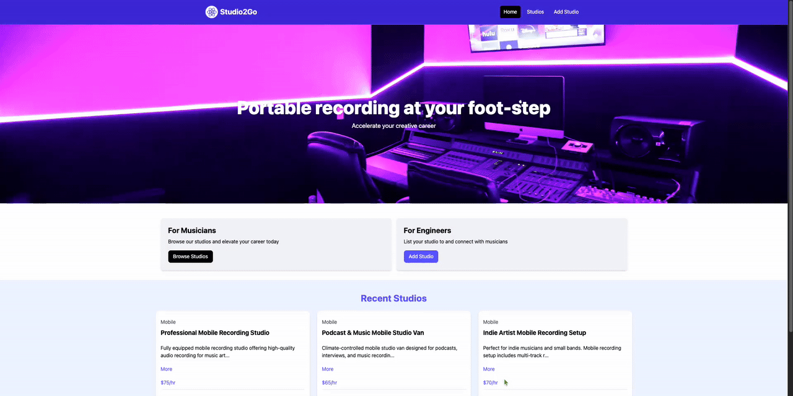
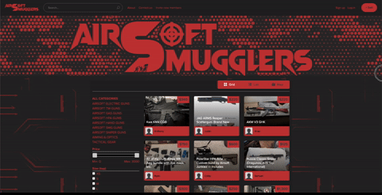
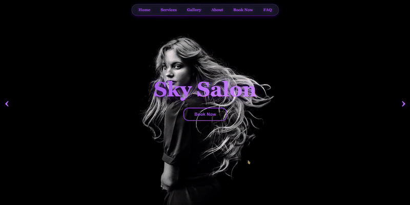

  

<h1 align="center">Hi 👋, I'm Isaiah</h1>
<h3 align="center">A driven Software Engineer from North Andover, MA</h3>

- 🔭 I’m currently working on [QuickTick](https://github.com/ngisaiah/quick_tick)

- 🌱 I’m currently learning **React**

- 🤝 I’m looking for help with **creating trading algorithms**

- 💬 Ask me about **Express JS**

- 📫 How to reach me **ngisaiah17@gmail.com**

- ⚡ Fun fact **I spent 3 months backpacking in Europe!**

<h3 align="left">Connect with me:</h3>

<h3 align="left">Languages and Tools:</h3>

            

<h1 align="center">Projects</h1>
<table bordercolor="#66b2b2" width='100%'>

  <tr>
        <td colspan="1" valign="top">
      <h3 align="center">Studio2Go</h3>
         
            
         
        

           
  
  
  

      
<strong>Javascript, React, JSON-Server, TailWindCSS</strong> - A platform that connects artists with local sound engineers, allowing musicians to book recording sessions, and have engineers travel to them to capture high-quality music,or creative projects. This project uses JSON-server for a mock backend..

  </td>
    
  <td colspan="1" valign="top">
      <h3 align="center">QuickTick</h3>
         
            
         
        

           
  
  
  

      
<strong>Javascript, CSS, Express, Materialize, Handlebars</strong> - A full-stack application with Google authentication used for tracking cryptocurrencies! Users are able to sign in and add their top coins to their favorites. There is also a "Notes" section used for storing any useful information along with delete functionality.

  </td>
  </tr>
  
  <tr>
    <td width="50%" valign="top">
      <h3 align="center">AirsoftSmugglers</h3>
         
            
         
        

           
  
  

      
<strong>Javascript, CSS, MySQL</strong> - A full font-end revamp for AirsoftSmugglers: an airsoft marketplace with over 7,000 Users! I was tasked with retrieving a copy of their MySQL database and filtering inactive users so we could schedule a time to delete those accounts.

  </td>
  <td width="50%" valign="top">
      <h3 align="center">Sky Salon</h3>
   
      
   
  

          
  
  
  

  
<strong>HTML, CSS, Javascript, Netlify</strong> - A modern, responsive website built for a contemporary hair salon, focused on clean design, intuitive navigation, and showcasing services with a sleek, user-friendly experience.

    </td>
  </tr>
</table>

<!--
**ngisaiah/ngisaiah** is a ✨ _special_ ✨ repository because its `README.md` (this file) appears on your GitHub profile.

Here are some ideas to get you started:

- 🔭 I’m currently working on ...
- 🌱 I’m currently learning ...
- 👯 I’m looking to collaborate on ...
- 🤔 I’m looking for help with ...
- 💬 Ask me about ...
- 📫 How to reach me: ...
- 😄 Pronouns: ...
- ⚡ Fun fact: ...
-->
